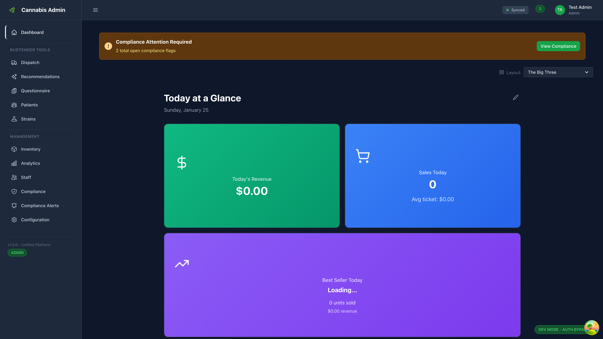
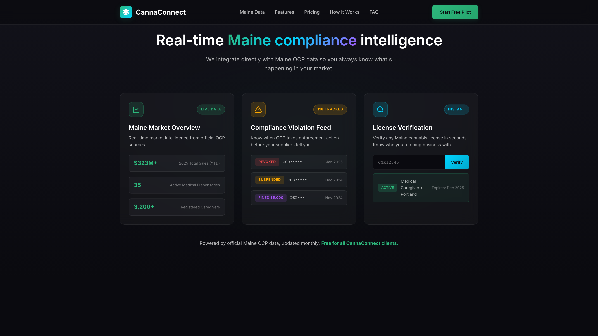
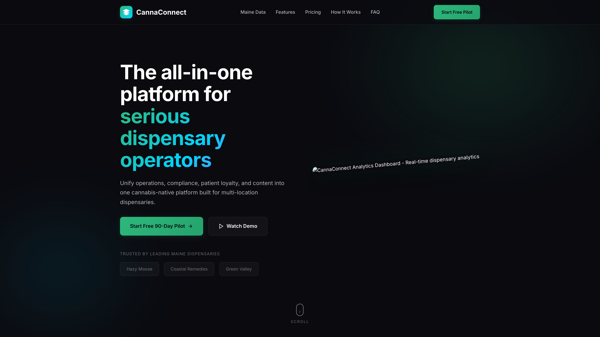
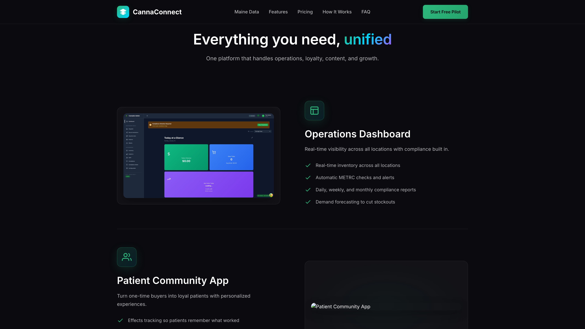

# Eclipse Demo Suite

Unified monorepo for the Eclipse patient, driver, dispatch, and medcard/secure-call demo stack.

## App Matrix

| App | Path | Local URL | Start Command |
|---|---|---|---|
| Patient App | `apps/patient-app` | `http://localhost:3000` | `npm run dev:patient` |
| Driver App | `apps/driver-app` | `http://localhost:3001` | `npm run dev:driver` |
| Dispatch App | `apps/dispatch-standalone` | `http://127.0.0.1:5186` | `npm run dev:dispatch` |
| Admin Dashboard | `apps/admin-dashboard` | `http://127.0.0.1:5177` | `npm run dev:admin` |
| Medcard App | `apps/medcard-standalone` | `http://127.0.0.1:5187` | `npm run dev:medcard:app` |
| Scanner Kiosk | `apps/kiosk` | `http://127.0.0.1:5182` | `npm run dev:kiosk` |
| Secure Call Web | `apps/secure-call-web` | `http://127.0.0.1:5193` | `npm run dev:secure-call:web` |
| Secure Call Server | `apps/secure-call-server` | `http://127.0.0.1:8787` | `npm run dev:secure-call:server` |

## Quick Start

```bash
npm install
```

Core commerce stack (patient + driver + dispatch):

```bash
npm run dev:core
```

Medcard + secure-call stack:

```bash
npm run dev:medcard
```

Convex backend:

```bash
npm run dev:convex
```

## Repo Structure

```text
eclipse-demo-suite/
  apps/
    patient-app/
    driver-app/
    dispatch-standalone/
    admin-dashboard/
    medcard-standalone/
    kiosk/
    secure-call-web/
    secure-call-server/
  convex/
  packages/
  docs/
    REPO_MAP.md
    screenshots/
```

## Screenshots

### Admin Dashboard









### Upcoming Captures

The following screenshot slots are prepared and should be added as files under `docs/screenshots/`:
- `patient-home.png`
- `driver-map.png`
- `dispatch-board.png`

## Patient App Mirror

`apps/patient-app` is mirrored to:
- [shawngarlandgit/eclipse-patient-app](https://github.com/shawngarlandgit/eclipse-patient-app)

Mirror workflow:
- `.github/workflows/patient-app-mirror.yml`

Required secret in this monorepo:
- `PATIENT_APP_MIRROR_TOKEN`
